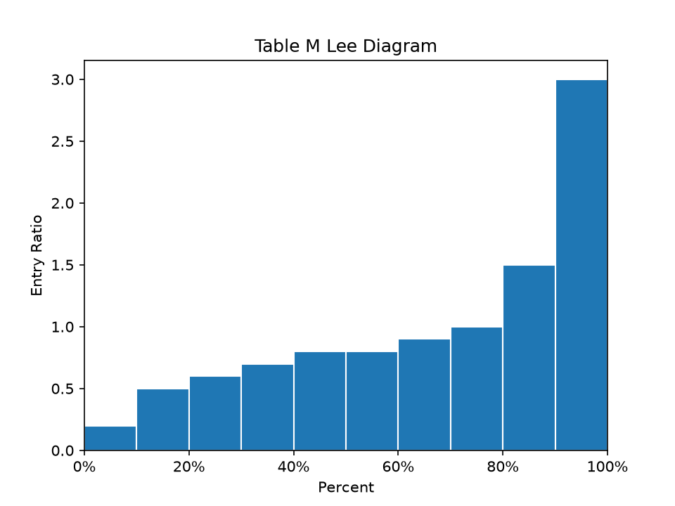

# hardhat

[](https://github.com/casact/hardhat/actions/workflows/pytest.yml)
[](https://codecov.io/github/casact/hardhat?branch=main)

Workers' compensation, retrospective and experience rating

# Introduction

hardhat aims to bring workers' compensation calculations into a single Python package by converting the algorithms from the (historical) CAS Exam 8 material into code. We will start with Table M construction (since it's one of the easier papers).

# Examples

## Table M Construction

```python
from hardhat import TableM
from hardhat.utils.utility_functions import load_sample

df = load_sample(key='brosius')

table_m = TableM(
    data=df, 
    experience='Actual Loss', 
    index="Risk"
)

print(table_m)

      Actual Loss  Entry Ratio
Risk                          
1           20000          0.2
2           50000          0.5
3           60000          0.6
4           70000          0.7
5           80000          0.8
6           80000          0.8
7           90000          0.9
8          100000          1.0
9          150000          1.5
10         300000          3.0

print(table_m.phi(r=1.2))

0.21000000000000002
```

## Lee Diagram

```python
table_m.lee_diagram().show()
```



# Relevant Papers

Brosius, J. Eric, "Table M Construction," *CAS Exam Study Note*, 2002, pp. 1-14.

Teng, Michael T.S., "Pricing Workers' Compensation Large Deductible and Excess Insurance," *Casualty Actuarial Society Forum*, Winter 1994, pp. 413-437.

# Experts needed!

If you happen to have experience in workers' compensation (\*cough\*, *ahem*), your participation will be greatly 
appreciated. This is intended to be a collaborative effort open to the general public.